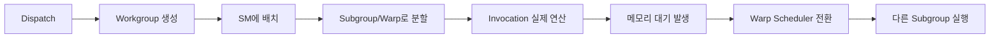

### 질문: 왜 GPU에서는 Warp와 Latency Hiding이 중요할까?
Vulkan Compute Shader를 쓰면 `Dispatch` 하나로 수천에서 수만 개의 workgroup이 생성됩니다. 이때 GPU가 실제로 어떤 단위로 계산을 실행하고, 왜 어떤 경우에는 속도가 아주 느려지는지 이해하는 것이 중요합니다.

- GPU가 동시에 여러 개의 명령을 실행할 때, 왜 항상 빠르지 않을까?
- `local_size = 256`로 설정했을 때 NVIDIA와 AMD에서 무엇이 달라질까?
- 메모리 대기 시간이 실제로 어디에서 발생하고, 이를 어떻게 숨길 수 있을까?

### 문제: 메모리 레이턴시와 SM 내부의 Stall
Vulkan의 실행 흐름은 대략 다음과 같습니다.

```
Dispatch
    ↓
Workgroup 생성
    ↓
SM에 배치
    ↓
SM 내부에서 Subgroup/Warp 실행
    ↓
Invocation들이 실제 연산 수행
```

여기서 문제가 발생합니다.

- `Dispatch`는 많은 workgroup을 만들지만, 각 workgroup은 실제로 SM에 배치돼야 합니다.
- SM 내부에서는 workgroup을 `subgroup`(Warp) 단위로 나누어 실행합니다.
- 한 warp가 VRAM에서 데이터를 기다리면, 그 warp에 속한 모든 lane이 멈출 수 있습니다.

즉, GPU에서 가장 큰 병목은 `SM 내부에서 Subgroup/Warp가 메모리를 기다리는 순간`입니다. 이때 발생하는 것이 바로 Stall입니다.

또 하나 중요한 점은 `local_size = 256`일 때의 차이입니다.

- NVIDIA: 256 = 8개 warp (각 32개 lane)
- AMD: 256 = 4개 wavefront (각 64개 lane)

같은 `local_size`라도 내부 실행 단위가 다르기 때문에, warp/wavefront 매핑을 염두에 두어야 합니다.

### 해결: Occupancy와 Latency Hiding
GPU는 빠르게 전환 가능한 여러 warp를 동시에 유지함으로써 Stall을 피해갑니다.

```
GPU
│
├── SM 0
│    ├── Warp Scheduler
│    ├── Registers
│    ├── Shared Memory
│    └── ALUs
├── SM 1
│    ├── Warp Scheduler
│    ├── Registers
│    ├── Shared Memory
│    └── ALUs
└── SM N
```

`local_size = 256`인 경우, SM 내부에서는 `Subgroup/Warp` 단위로 실행이 결정됩니다.

#### 왜 Latency Hiding이 가능한가?

- `Registers`는 warp별로 독립적이기 때문에, 한 warp에서 다른 warp로 전환해도 컨텍스트 비용이 매우 적습니다.
- `Shared Memory`는 같은 SM 내 workgroup이 공유하지만, warp 간 연산은 독립적으로 진행됩니다.
- `Warp Scheduler`는 메모리 대기 중인 warp 대신 준비된 다른 warp를 즉시 실행합니다.

이 과정을 통해 GPU는 메모리 대기 시간 동안도 ALU를 유휴 상태로 만들지 않습니다.

#### 메모리 계층과 레이턴시

```
VRAM (GDDR): 200~300 사이클
    ↓
L2 Cache: 30~40 사이클
    ↓
SM 내부
    ├ L1 Cache / Shared Memory: 4~8 사이클
    └ Registers: 1 사이클
```

따라서 `즉시 실행 가능한 warp`가 충분히 많아야 합니다. 이것이 바로 `occupancy`입니다.

### 실험: Vulkan Compute Shader로 직접 관찰하기
아래는 `local_size_x = 256`으로 설정한 실제 셰이더 예시입니다.

```glsl
#version 450
#extension GL_KHR_shader_subgroup_basic : require
#extension GL_KHR_shader_subgroup_arithmetic : require

layout(local_size_x = 256) in;
shared float sdata[256];
layout(binding=0) buffer InBuf { float inBuf[]; };
layout(binding=1) buffer OutBuf { float outBuf[]; };

void main() {
  uint local = gl_LocalInvocationID.x;
  uint global = gl_GlobalInvocationID.x;
  float v = inBuf[global];

  sdata[local] = v;
  memoryBarrierShared();
  barrier();

  float subgroupSum = subgroupAdd(v);
  if (subgroupElect()) {
    outBuf[gl_WorkGroupID.x] = subgroupSum;
  }
}
```

이 코드는 다음 흐름을 따릅니다.

1. 각 lane이 글로벌 메모리에서 값을 읽어 shared memory에 저장
2. barrier로 모든 lane이 저장을 마칠 때까지 기다림
3. `subgroupAdd`로 서브그룹 내부 합산 수행
4. 서브그룹 대표 lane이 결과를 저장

이때 중요한 관찰 지점은 다음입니다.

- `local_size = 256`이므로 한 workgroup 내부에 여러 warp/wavefront가 동시에 존재합니다.
- NVIDIA와 AMD에서 내부 실행 단위가 다르지만, 공통 점은 `한 Subgroup/Warp가 기다리는 동안 다른 Subgroup/Warp가 실행`된다는 점입니다.
- `subgroupAdd`는 lane 간 통신을 하드웨어 수준에서 최적화해 동기화 비용을 줄입니다.



### 과제: 실험 설계
비교할 실험은 두 가지입니다.

- `High-latency (pointer-chasing)`
  - global memory를 여러 번 따라가며 메모리 레이턴시를 의도적으로 키웁니다.
- `High-parallel (occupancy-focused)`
  - workgroup 수를 늘리고 더 많은 workgroup/subgroup을 활성화해 occupancy를 높입니다.

실험 절차는 다음과 같습니다.

1. 두 셰이더를 SPIR‑V로 컴파일합니다. (`glslangValidator` 권장)
2. 동일한 데이터 크기와 dispatch 크기를 유지하며 실행합니다.
3. GPU 타임스탬프 쿼리로 커널 실행 시간을 측정합니다.
4. `High-parallel`에서 dispatch 수를 늘려가며 실행 시간을 비교합니다.

이 실험에서 중요한 점은 `local_size_x = 256`일 때 NVIDIA는 8개 warp, AMD는 4개 wavefront가 한 workgroup에 포함된다는 점입니다.

### 결론

- GPU는 `Dispatch → Workgroup → SM → Subgroup/Warp → Invocation`의 여러 층으로 실행을 분해합니다.
- Stall의 주범은 `SM 내부에서 Subgroup/Warp가 메모리 대기`할 때 발생합니다.
- 이를 해결하는 핵심은 `occupancy`입니다. 즉, SM에 준비된 warp가 많이 있어야 latency hiding이 동작합니다.
- `local_size = 256`을 사용할 때, NVIDIA와 AMD 모두 여러 warp/wavefront가 한 workgroup 내에 들어가므로, 충분히 많은 workgroup을 스케줄하는 것이 중요합니다.

이제 이 글은 문제 중심 흐름으로 더 쉽게 읽히고, 실험 목표도 명확해졌습니다.


### Result Snapshot

현재 Vulkan 실험 프로젝트의 한 샘플 실행 결과입니다:

```text
RenderDoc 비교 대상이 준비되었습니다.
이 실행을 캡처하고 두 디스패치를 비교하세요:
  1. High Latency Dispatch (높은 레이턴시)
  2. High Occupancy Dispatch (높은 점유율)
GPU 타이밍:
  high-latency: 24.3827 ms
  high-occupancy: 1.07854 ms
출력 샘플:
  high-latency[0..3]: 99328, 963328, 461312, 133888
  high-occupancy[0..3]: 1562218794, 663053616, 3836931014, 3270840780
```

이 실행에서 포인터 체이싱 방식의 `high-latency` 디스패치는 점유율 중심의 디스패치보다 훨씬 오래 걸렸습니다.
이것은 모든 GPU에서 보편적인 결과는 아니지만, 레이턴시에 민감한 메모리 접근과 처리량 친화적인 연산 패턴의 차이를 보여주는 구체적인 예입니다.
