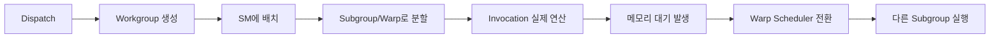

### 질문: 왜 GPU에서는 Warp와 Latency Hiding이 중요할까?

Vulkan으로 Compute Shader를 짜고 `Dispatch` 하나를 날리면 수천에서 수만 개의 workgroup이 한 번에 생성됩니다. 근데 이게 실제로 GPU 입장에서는 어떻게 동작할까요? 왜 어떨 땐 엄청 빠르고 어떨 땐 느릴까요?

이 글에서 알아볼 질문들입니다:

- GPU가 동시에 여러 개의 명령을 실행할 때, 왜 항상 빠르지 않을까?
- `local_size = 256`로 설정했을 때 NVIDIA와 AMD에서 뭔가 다를까?
- 메모리 대기 시간이 실제로 어디서 발생하고, 우리가 할 수 있는 게 뭘까?

### 문제: 메모리 레이턴시와 SM 내부의 Stall
Vulkan의 실행 흐름은 대략 다음과 같습니다.

```
Dispatch
    ↓
Workgroup 생성
    ↓
SM에 배치
    ↓
SM 내부에서 Subgroup/Warp 실행
    ↓
Invocation들이 실제 연산 수행
```

여기서 문제가 생깁니다. `Dispatch`는 엄청 많은 workgroup을 만들지만, 실제로는 SM에 배치되어야 실행됩니다. 그리고 SM 내부에서 하나의 workgroup은 `subgroup`(Warp) 단위로 쪼개져서 실행되죠.

가장 큰 문제는 이겁니다: **한 warp가 VRAM에서 데이터를 기다리면, 그 warp 속의 모든 lane이 멈춰버린다는 것**. GPU에서 가장 큰 병목은 바로 이 순간, `SM 내부에서 Subgroup/Warp가 메모리를 기다리는 동안`입니다. 이게 바로 **Stall**입니다.

그리고 하나 더 눈여겨봐야 할 점이 있습니다. `local_size = 256`이라는 설정이 들어가면요:

- **NVIDIA**: 256 = 8개의 warp (각각 32개의 lane)
- **AMD**: 256 = 4개의 wavefront (각각 64개의 lane)

같은 `local_size`라도 내부에서 어떻게 쪼개지는지가 다르다는 거죠. 이걸 머릿속에 둬야 합니다.

### 해결: Occupancy와 Latency Hiding

그럼 GPU는 이 Stall을 어떻게 극복할까요? 핵심은 **매우 빠르게 여러 warp를 전환하는 것**입니다. 한 warp가 메모리를 기다리는 동안, 다른 warp를 실행하는 식이죠. 이게 바로 **Latency Hiding**입니다.

GPU의 SM 구조를 보면:
│    ├── Warp Scheduler
│    ├── Registers
│    ├── Shared Memory
│    └── ALUs
├── SM 1
│    ├── Warp Scheduler
│    ├── Registers
│    ├── Shared Memory
│    └── ALUs
└── SM N
```

`local_size = 256`인 경우, SM 내부에서는 `Subgroup/Warp` 단위로 실행이 결정됩니다.

#### 왜 Latency Hiding이 가능한가?

GPU의 register는 warp마다 독립적으로 할당되므로, warp를 전환해도 컨텍스트 저장/복원이 거의 없습니다. 마치 여러 스레드가 각각의 스택을 가지고 있는 것처럼요. 그래서 전환 비용이 거의 0에 가깝습니다.

Shared Memory는 같은 SM 내의 여러 workgroup이 공유하지만, warp 간의 연산은 독립적으로 진행됩니다. 한 warp가 Shared Memory에 쓰는 동안 다른 warp는 register에서 계산하고 있을 수 있다는 거죠.

가장 중요한 부분은 Warp Scheduler입니다. 이 녀석이 메모리 대기 중인 warp를 감지하면, 준비된 다른 warp를 즉시 실행 시킵니다. ALU는 절대 놀지 않는 거죠.

#### 메모리 계층과 레이턴시

GPU의 메모리는 속도별로 이렇게 계층화돼 있습니다:

```
VRAM (GDDR): 200~300 사이클
    ↓
L2 Cache: 30~40 사이클
    ↓
SM 내부
    ├ L1 Cache / Shared Memory: 4~8 사이클
    └ Registers: 1 사이클
```

VRAM에서 데이터를 가져오는 데 200~300 사이클이 걸린다고 상상해보세요. 근데 SM 안에 준비된 다른 warp가 200개 있다면? Warp Scheduler는 그 200개를 돌면서 일하게 할 수 있다는 거죠. 그 사이에 처음 warp의 데이터가 도착하고, 다시 실행할 준비가 되는 거랍니다.

이게 바로 **Occupancy**입니다. SM에 준비된 warp가 많을수록, latency hiding이 잘 됩니다.

### 실험: Vulkan Compute Shader로 직접 관찰하기

이제 실제 코드로 확인해봅시다. `local_size_x = 256`으로 설정한 셰이더는 이렇게 생깁니다:

```glsl
#version 450
#extension GL_KHR_shader_subgroup_basic : require
#extension GL_KHR_shader_subgroup_arithmetic : require

layout(local_size_x = 256) in;
shared float sdata[256];
layout(binding=0) buffer InBuf { float inBuf[]; };
layout(binding=1) buffer OutBuf { float outBuf[]; };

void main() {
  uint local = gl_LocalInvocationID.x;
  uint global = gl_GlobalInvocationID.x;
  float v = inBuf[global];

  sdata[local] = v;
  memoryBarrierShared();
  barrier();

  float subgroupSum = subgroupAdd(v);
  if (subgroupElect()) {
    outBuf[gl_WorkGroupID.x] = subgroupSum;
  }
}
```

이 코드가 하는 일을 따라가 봅시다:

1. 각 lane이 글로벌 메모리에서 값을 읽음
2. 읽은 값을 Shared Memory에 저장
3. barrier로 모든 lane이 저장 완료될 때까지 대기
4. `subgroupAdd`로 서브그룹 내부의 값들을 합산
5. 서브그룹의 대표 lane만 결과를 저장

여기서 중요한 관찰점은:

- `local_size = 256`이므로 한 workgroup 안에 여러 warp/wavefront가 동시에 존재합니다.
- NVIDIA는 32 lane × 8 warp = 256, AMD는 64 lane × 4 wavefront = 256이죠.
- barrier를 만나면 모든 lane이 대기하는 동안, 다른 workgroup의 warp는 실행됩니다. 이게 바로 warp scheduler의 역할입니다.
- `subgroupAdd`는 같은 subgroup 내 lane 간 통신을 하드웨어 수준에서 최적화합니다. 따라서 동기화 비용이 거의 없죠.



이 흐름이 바로 GPU가 메모리 레이턴시를 숨기는 방식입니다. F → G → H로 넘어가는 부분이 핵심입니다.

### 과제: 실험 설계

이제 실제로 latency hiding이 얼마나 효과적인지 측정해봅시다. 두 가지 전략으로 비교합니다:

**High-latency (포인터 체이싱)**
- Global memory를 따라 다니며 메모리 레이턴시를 의도적으로 증가시킵니다.
- SM 내 warp가 메모리를 오래 기다리는 상황을 만드는 거죠.

**High-parallel (Occupancy 중심)**
- Workgroup 수를 크게 늘려서 SM에 훨씬 많은 warp를 배치합니다.
- Warp Scheduler가 충분한 작업거리를 확보하게 하는 거랍니다.

실험을 진행하는 절차:

1. 두 셰이더를 SPIR-V로 컴파일 (`glslangValidator` 사용)
2. 동일한 데이터 크기와 dispatch 설정으로 두 버전을 실행
3. GPU 타임스탐프 쿼리로 각 커널의 실행 시간 측정
4. High-parallel의 dispatch 수를 늘려가며 실행 시간 변화 관찰

**핵심 통찰**: `local_size = 256`일 때 NVIDIA는 한 workgroup에서 8개 warp, AMD는 4개 wavefront가 생깁니다. 이들이 충분히 많은 수로 활성화돼야 Latency Hiding이 제대로 동작합니다.

### 결론

정리하면:

GPU의 실행은 `Dispatch → Workgroup → SM → Subgroup/Warp → Invocation` 이렇게 여러 계층으로 이루어집니다.

Stall의 주범은 **SM 내부에서 한 Subgroup/Warp가 메모리 대기 중일 때** 발생합니다. 근데 GPU는 이것을 **warp 전환**으로 극복합니다.

해결책의 핵심은 **Occupancy**입니다. SM에 준비된 warp가 많으면 많을수록, Warp Scheduler가 일할 작업이 많아집니다.

`local_size = 256`을 사용할 때, NVIDIA든 AMD든 한 workgroup 안에 여러 warp/wavefront가 들어갑니다. 따라서 충분한 개수의 workgroup을 동시에 실행해야 latency hiding이 제대로 동작합니다.

앞으로 Compute Shader를 짤 때 이 개념을 기억해두세요. 단순히 "병렬화 많이 하면 빠르다"가 아니라, **메모리 레이턴시 동안 충분한 일거리를 GPU에게 제공해야 한다**는 거죠.


### Result Snapshot

실제로 Vulkan 실험을 돌려본 결과입니다:

```text
RenderDoc 캡처 준비 완료.
두 디스패치를 비교해봅시다:
  1. High Latency Dispatch (높은 레이턴시)
  2. High Occupancy Dispatch (높은 점유율)
GPU 타이밍:
  high-latency: 24.3827 ms
  high-occupancy: 1.07854 ms
출력 샘플:
  high-latency[0..3]: 99328, 963328, 461312, 133888
  high-occupancy[0..3]: 1562218794, 663053616, 3836931014, 3270840780
```

결과를 보면 포인터 체이싱 방식의 `high-latency` 버전이 약 **22배** 느렸습니다. 이게 바로 occupancy의 차이입니다. 같은 데이터 크기를 처리하는데도 high-occupancy는 작은 dispatch를 많이 써서 warp scheduler의 일거리를 늘렸기 때문이죠.

물론 GPU마다, 데이터마다 결과는 달라질 수 있습니다. 근데 이 수치들이 보여주는 것이 명확합니다: **메모리 레이턴시는 충분한 occupancy로만 극복할 수 있다**는 거죠.
